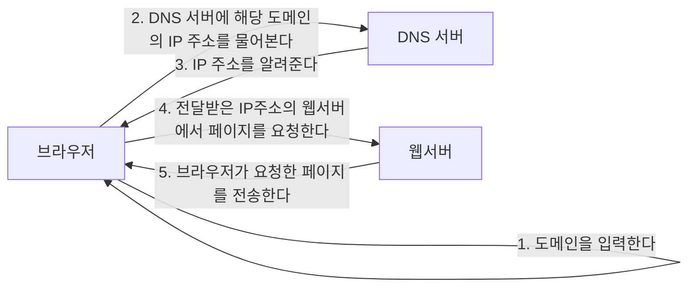
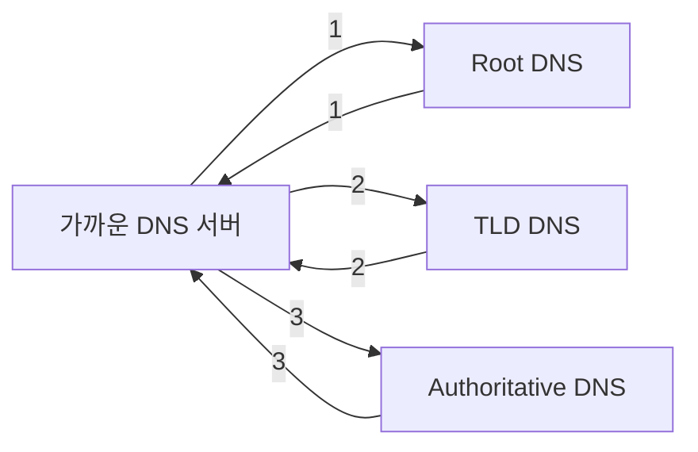

# 웹 브라우저에 `네이버` 를 검색하고 화면에 네이버 화면이 출력이 될 때 까지 내부적으로 어떤 동작들이 수행이 되는지 설명해주세요.

### 요약

### 가까운 DSN 서버에 해당 도메인에 대한 내용이 없는 경우

1. 주소창에 입력한 naver.com을 Root DNS 서버에 보내서 .com에 정보들이 있는 서버 위치를 알려줍니다. 
2. Root DNS에서 받은 .com의 정보를 통해 TLD 서버로 이동하여 naver.com의 정보를 가진 서버의 위치를 받습니다.
3. naver.com의 정보를 가진 서버로 와서 `www.naver.com, mail.naver.com,section.cafe.naver.com` 등 정보들 중에 사용자가 입력한 정보를 전달합니다.

### naver에 요청 및 전달받는 과정

1. 네이버에 요청하기 위해 패킷을 만드는데 이때 라우팅 테이블을 보고 네이버로 가기위해서는 그림에 있는 라우터로 가야하는 것을 확인한 후 라우터로 가기 위해 2계층 MAC주소는 라우터의 MAC 주소가 되고, 3계층의 IP 주소는 네이버의 IP 주소가 됩니다.
2. 전달받은 패킷을 확인하여 2계층 MAC 주소를 통해 자신에게 온것을 확인하여 3계층 데이터를 확인합니다. 3계층에서 목적지 IP 주소가 본인이 아니여서 라우팅 테이블을 확인하여 다음으로 이동할 곳을 확인 후 전달합니다.
3. 라우터에서 패킷을 전달받은 네이버는 2,3 계층 정보 모두 본인인 것을 확인하여 요청 내용을 확인 후 전달할 데이터를 패킷에 넣고 2계층 MAC 주소는 라우터의 주소를 넣고, 3계층의 도착지 IP는 사용자의 IP를 넣어 전달합니다.
4. 2번과 동일하게 적용되어 사용자에게 전달합니다. 사용자는 2,3 계층의 있는 MAC 주소와 IP를 통해 본인에게 전달된 데이터인 것을 인지하여 패킷에 담긴 데이터를 확인하여 네이버 화면을 출력해줍니다.